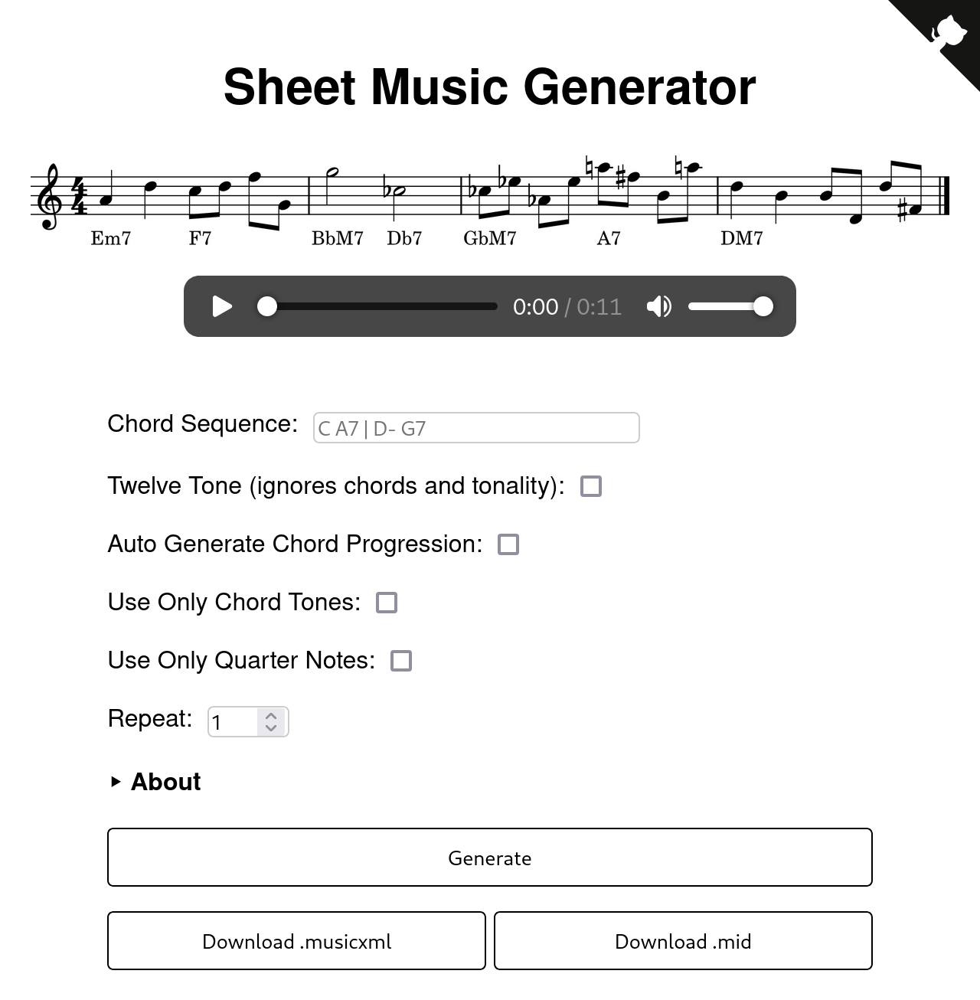

# Sheet Music Generator

Generate melodies from chords.

## setup

uses `Python 3.12.4`

install requirements with 

`pip install -r requirements.txt`

run with 

`python app.py`

the server will be available at `http://127.0.0.1:5000/`
